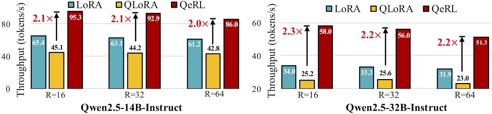
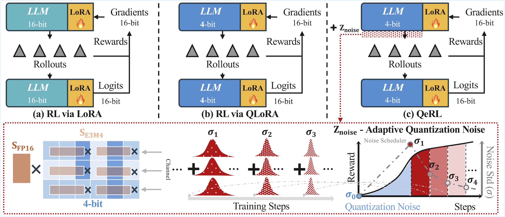
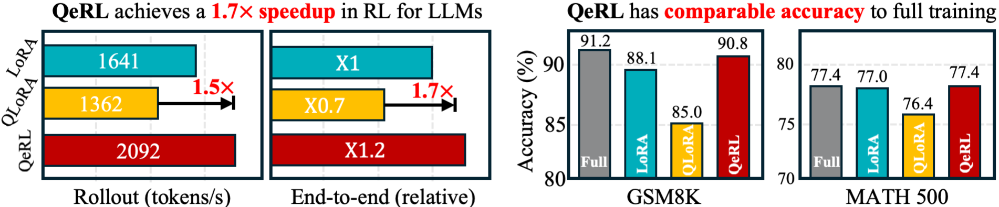
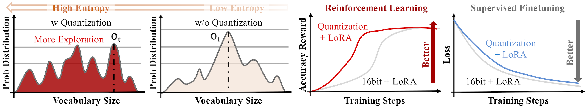
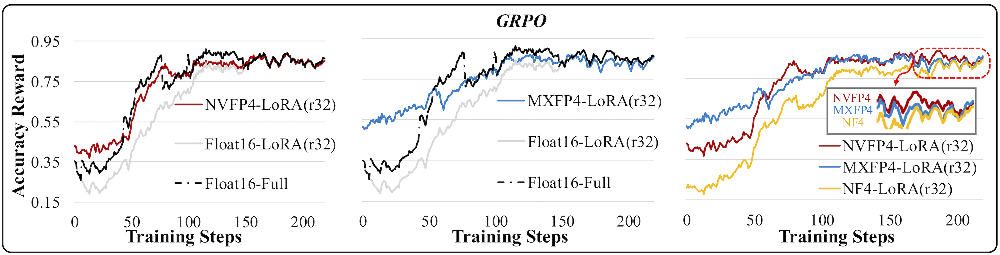
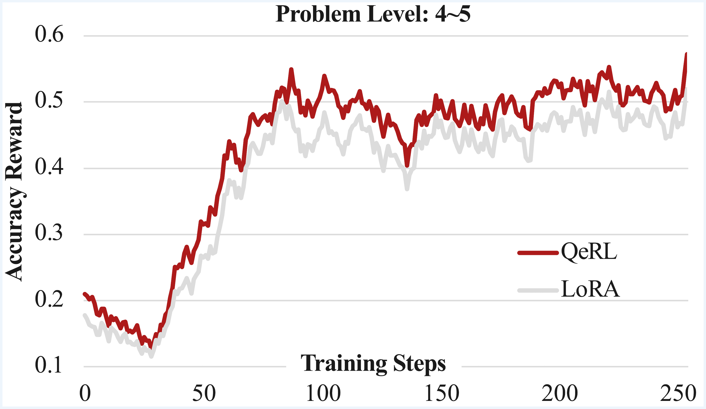

# Quantization-enhanced Reinforcement Learning (QeRL)

**QeRL** is a Quantization-enhanced RL framework for large language models. It combines **NVFP4 quantization** with **LoRA**, introduces **Adaptive Quantization Noise (AQN)** to boost exploration, accelerates rollouts by **1.5×**, and enables RL training of **32B models** on a **single 80GB GPU**—matching the performance of full fine-tuning on benchmarks like **GSM8K** and **MATH**.

---

## 🔧 Key Innovations

### 🧠 Adaptive Quantization Noise (AQN)

Quantizing a model (e.g., reducing its precision) naturally introduces small, random noise. In Reinforcement Learning, this randomness increases entropy—encouraging exploration. QeRL controls this injected noise to balance exploration and exploitation during training.

---

### 📈 Performance Highlights

  
*Quantization noise leads to higher initial entropy, accelerating reward optimization.*

---

  
  
  
*QeRL leverages NVFP4 for fast, low-cost LoRA training, with adaptive quantization noise injection.*

---

  
  
*In GRPO-style RL training, quantized models show faster and better reward convergence.*

---

  
*Training reward curve for the Qwen2.5-32B-Instruct model.*

---

## 🚀 Installation

### ✅ Requirements

- NVIDIA GPU with **NVFP4** support (e.g., **H100**, **B100**, **RTX 5090**)
- Linux OS
- 64 GB RAM

### 🔧 Environment Setup

Use Conda to manage the environment:

```bash
conda create -n qerl python=3.10
conda activate qerl
pip install -r requirements.txt
````

---

## 📚 Feature Overview

| Feature                               | Description                                                                               |
| ------------------------------------- | ----------------------------------------------------------------------------------------- |
| **NVFP4 Quantization**                | NVIDIA's 4-bit format for memory-efficient, high-speed inference and training.            |
| **LoRA (Low-Rank Adaptation)**        | Lightweight fine-tuning technique that updates low-rank layers only.                      |
| **Adaptive Quantization Noise (AQN)** | Injects controlled noise to improve RL exploration and reward optimization.               |
| **High Scalability**                  | Enables training of 32B parameter models on a single 80GB GPU, avoiding multi-GPU setups. |

---

## 📌 Notes

* Ensure `assets/` folder is properly structured in the repo to render images.
* For more examples, benchmarks, or research context, see the [Docs](link-to-docs-if-available) or [Paper](link-to-paper-if-applicable).

---

## 🧠 Citation

> If you use QeRL in your research or projects, please cite us!
> *(Add BibTeX or DOI when available)*

